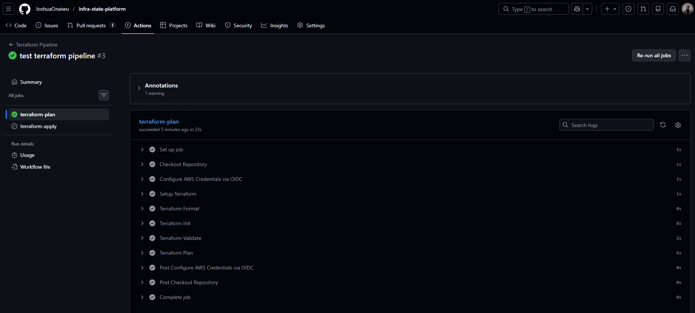
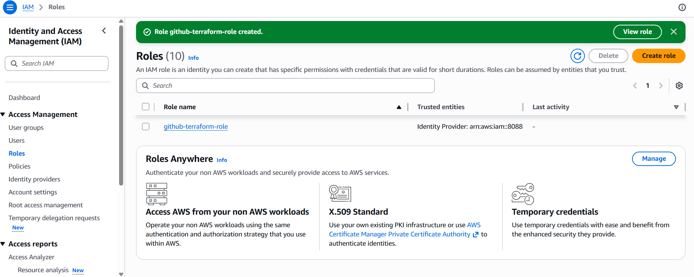

# Terraform Infrastructure State Platform

A production-style Terraform backend platform that demonstrates secure, centralized state management and CI-driven infrastructure delivery using AWS and GitHub Actions.

This project provisions and manages a Terraform remote backend using **Amazon S3** for state storage and **DynamoDB** for state locking, while enforcing infrastructure changes through a **Pull Request–based CI/CD workflow**.

The goal of the project is to simulate how real platform engineering teams manage infrastructure state safely across teams and environments.

---

# Architecture Overview

The system follows a controlled infrastructure delivery workflow:

Developer → GitHub Repository → GitHub Actions → AWS Infrastructure

Infrastructure changes follow this process:

1. Engineer creates a feature branch  
2. Pull Request triggers Terraform Plan  
3. Infrastructure changes are reviewed  
4. Merge to main triggers Terraform Apply  
5. Terraform updates AWS infrastructure  

This ensures infrastructure changes are **auditable, repeatable, and protected from unsafe manual execution**.

---

# Key Features

- Remote Terraform state stored in Amazon S3  
- State locking using DynamoDB  
- Secure authentication using GitHub OIDC → AWS IAM Role  
- CI-driven Terraform execution (no local Terraform applies)  
- Pull Request–based infrastructure change control  
- Versioned infrastructure state  
- Architecture documentation and ADR records  

---

# Project Structure

infra-state-platform
│
├── bootstrap
│ ├── main.tf
│ ├── providers.tf
│ ├── outputs.tf
│ └── .terraform.lock.hcl
│
├── infra
│ ├── backend.tf
│ ├── main.tf
│ ├── providers.tf
│ ├── variables.tf
│ ├── outputs.tf
│ └── .terraform.lock.hcl
│
├── docs
│ ├── architecture.md
│ └── adr-001-terraform-backend.md
│
├── screenshots
│ ├── IAM-OIDC-role-configuration.png
│ └── terraform-plan-stage.png
│
├── .github
│ └── workflows
│ └── terraform.yml
│
├── README.md
└── .gitignore

---

# Terraform Backend Architecture

The backend infrastructure created by the `bootstrap` module includes:

## Amazon S3

Used to store Terraform state files.

Configuration:

- Versioning enabled  
- Server-side encryption enabled  
- Public access blocked  

State path:

env/dev/terraform.tfstate

---

## DynamoDB

Used for Terraform state locking.

This prevents multiple Terraform runs from modifying the same state simultaneously.

Table name:

infra-state-platform-locks

---

# CI/CD Infrastructure Pipeline

Infrastructure changes are executed through **GitHub Actions**, not developer machines.

Pipeline stages:

terraform fmt
terraform validate
terraform init
terraform plan
terraform apply

Workflow behavior:

Pull Request → Terraform Plan
Merge to main → Terraform Apply

---

# Authentication Model

The system uses **GitHub OIDC federation** instead of static AWS credentials.

Authentication flow:

GitHub Actions → OIDC Token → AWS STS → IAM Role → Temporary Credentials

IAM Role used:

github-terraform-role

Benefits:

- No long-lived credentials  
- Short-lived access tokens  
- Improved security posture  

---

# Example Pipeline Execution

## Terraform Plan Stage

## AWS IAM Role Configuration for OIDC

---

# Why This Project Matters

Terraform state is one of the most critical components of infrastructure automation.

Improper state management can lead to:

- infrastructure drift  
- resource corruption  
- concurrent modification failures  
- security risks  

This platform demonstrates how engineering teams build **secure, centralized state platforms** to manage infrastructure safely at scale.

---

# Technologies Used

- Terraform  
- AWS S3  
- AWS DynamoDB  
- AWS IAM  
- GitHub Actions  
- GitHub OIDC Federation  

---

# Future Improvements

- Multi-environment backend structure (dev / staging / prod)  
- Terraform module standardization  
- Policy enforcement with OPA / Sentinel  
- Drift detection workflows  
- Infrastructure observability  

---